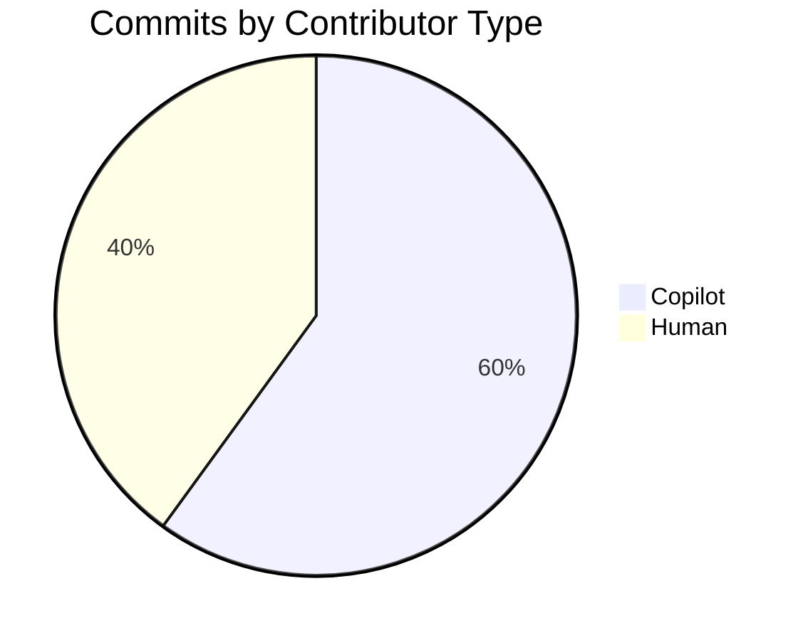
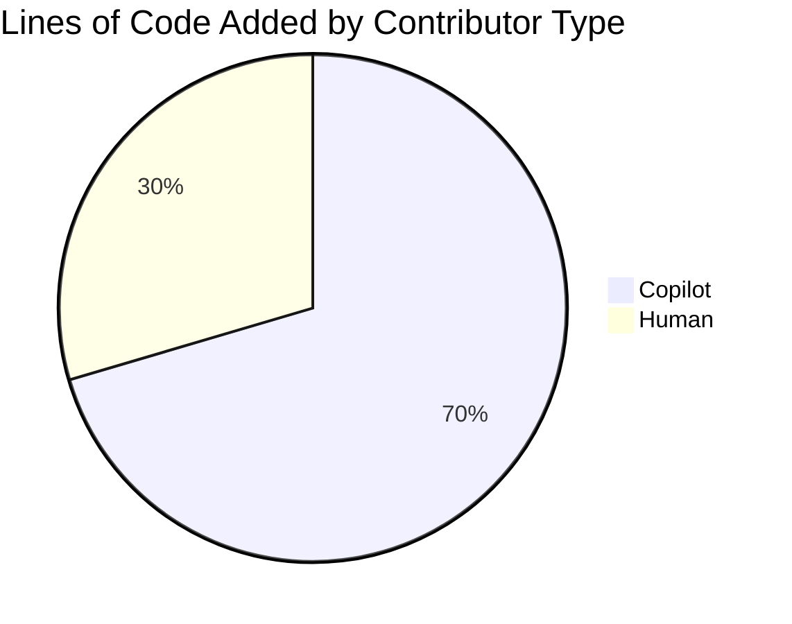
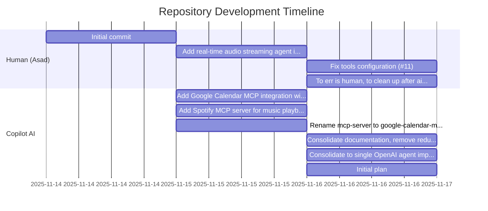

# Repository History Analysis: GitHub Copilot vs Human Contributors

**Generated:** 2025-11-16

## Executive Summary

This report provides a comprehensive analysis of the `realtime-audio-agents-playground` repository's contribution history, distinguishing between code authored by GitHub Copilot (AI-assisted commits) and human contributors.

### Key Findings

- **Total Commits:** 10
- **Copilot Commits:** 6 (60.0%)
- **Human Commits:** 4 (40.0%)
- **Total Lines Added:** 9,257
- **Copilot Lines Added:** 6,520 (70.4%)
- **Human Lines Added:** 2,737 (29.6%)
- **Repository Age:** 3 days
- **Active Contributors:** 3 (1 human, 2 AI)

## Overall Contribution Comparison

### Copilot vs Human: At a Glance

| Metric | Copilot | Human | Total |
|--------|---------|-------|-------|
| **Commits** | 6 (60.0%) | 4 (40.0%) | 10 |
| **Lines Added** | 6,520 (70.4%) | 2,737 (29.6%) | 9,257 |
| **Lines Deleted** | 2,458 | 169 | 2,627 |
| **Net Lines** | 4,062 | 2,568 | 6,630 |
| **Files Changed** | 79 | 20 | 99 |
| **Avg Lines/Commit** | 1,086 | 684 | 925 |

### Contribution Distribution

## Detailed Breakdown by Author

### Individual Contributor Statistics

| Author | Type | Commits | Lines Added | Lines Deleted | Net Lines | Files Changed | Avg Lines/Commit |
|--------|------|---------|-------------|---------------|-----------|---------------|------------------|
| Copilot | Copilot | 5 | 6,520 | 2,458 | 4,062 | 79 | 1,304 |
| Asad | Human | 4 | 2,737 | 169 | 2,568 | 20 | 684 |
| copilot-swe-agent[bot] | Copilot | 1 | 0 | 0 | 0 | 0 | 0 |

### Author Activity Periods

| Author | First Commit | Last Commit | Active Days |
|--------|--------------|-------------|-------------|
| Copilot | 2025-11-15 | 2025-11-16 | 2 |
| Asad | 2025-11-14 | 2025-11-16 | 3 |
| copilot-swe-agent[bot] | 2025-11-16 | 2025-11-16 | 1 |

## Contribution Timeline

### Chronological Commit History

### Daily Contribution Activity

| Date | Author | Type | Commits | Lines Added | Lines Deleted | Summary |
|------|--------|------|---------|-------------|---------------|---------|
| 2025-11-14 | Asad | Human | 1 | 883 | 0 | Initial commit |
| 2025-11-15 | Copilot | Copilot | 1 | 4,513 | 0 | Add Google Calendar MCP integration with 6 calendar tools (#3) |
| 2025-11-15 | Copilot | Copilot | 1 | 1,645 | 0 | Add Spotify MCP server for music playback control (#5) |
| 2025-11-15 | Asad | Human | 1 | 153 | 0 | Add real-time audio streaming agent implementation (#8) |
| 2025-11-15 | Copilot | Copilot | 1 | 40 | 55 | Rename mcp-server to google-calendar-mcp-server (#10) |
| 2025-11-16 | Asad | Human | 1 | 1,401 | 4 | Fix tools configuration (#11) |
| 2025-11-16 | Copilot | Copilot | 1 | 468 | 1,805 | Consolidate documentation, remove redundant validation scri... |
| 2025-11-16 | Copilot | Copilot | 1 | 130 | 573 | Consolidate to single OpenAI agent implementation (#15) |
| 2025-11-16 | Asad | Human | 1 | 300 | 165 | To err is human, to clean up after ai is the real janitorial... |
| 2025-11-16 | copilot-swe-agent[bot] | Copilot | 1 | 0 | 0 | Initial plan |

## Detailed Commit Analysis

### Commit Details with File Changes

#### 1. Initial commit

- **Commit Hash:** `158ed8fcd3cd`
- **Author:** Asad (Human)
- **Date:** 2025-11-14 17:54:16
- **Lines Added:** 883
- **Lines Deleted:** 0
- **Net Lines:** 883
- **Files Changed:** 3

**Modified Files:**

| File | Lines Added | Lines Deleted | Net Change |
|------|-------------|---------------|------------|
| `.gitignore` | 207 | 0 | +207 |
| `LICENSE` | 674 | 0 | +674 |
| `README.md` | 2 | 0 | +2 |

#### 2. Add Google Calendar MCP integration with 6 calendar tools (#3)

- **Commit Hash:** `ac2a011ce9b7`
- **Author:** Copilot (Copilot)
- **Date:** 2025-11-15 04:25:52
- **Lines Added:** 4,513
- **Lines Deleted:** 0
- **Net Lines:** 4,513
- **Files Changed:** 29

**Modified Files:**

| File | Lines Added | Lines Deleted | Net Change |
|------|-------------|---------------|------------|
| `.env.example` | 20 | 0 | +20 |
| `.gitignore` | 17 | 0 | +17 |
| `CONTRIBUTING.md` | 229 | 0 | +229 |
| `QUICKFIX.md` | 123 | 0 | +123 |
| `README.md` | 187 | 0 | +187 |
| `docs/AGENT_SYSTEM_INSTRUCTIONS.md` | 122 | 0 | +122 |
| `docs/FIX_ASYNC_CONTEXT_MANAGER.md` | 102 | 0 | +102 |
| `docs/GOOGLE_CALENDAR_SETUP.md` | 363 | 0 | +363 |
| `docs/QUICKSTART.md` | 211 | 0 | +211 |
| `docs/STATUS_SUMMARY.md` | 182 | 0 | +182 |
| `docs/TROUBLESHOOTING_MCP_TIMEOUT.md` | 225 | 0 | +225 |
| `examples/README.md` | 268 | 0 | +268 |
| `examples/advanced_examples.py` | 263 | 0 | +263 |
| `examples/test_calendar.py` | 158 | 0 | +158 |
| `examples/test_connection.py` | 42 | 0 | +42 |
| `main.py` | 31 | 0 | +31 |
| `mcp-server/package.json` | 19 | 0 | +19 |
| `mcp-server/server.js` | 532 | 0 | +532 |
| `pyproject.toml` | 38 | 0 | +38 |
| `requirements.txt` | 10 | 0 | +10 |
| `scripts/README.md` | 129 | 0 | +129 |
| `scripts/check_env.py` | 63 | 0 | +63 |
| `scripts/diagnose_mcp.py` | 138 | 0 | +138 |
| `scripts/get-refresh-token.js` | 108 | 0 | +108 |
| `scripts/package.json` | 13 | 0 | +13 |
| `scripts/test_mcp_direct.py` | 95 | 0 | +95 |
| `scripts/verify_setup.py` | 222 | 0 | +222 |
| `src/__init__.py` | 0 | 0 | +0 |
| `src/agent_host/__init__.py` | 5 | 0 | +5 |
| `src/agent_host/calendar_agent.py` | 307 | 0 | +307 |

#### 3. Add Spotify MCP server for music playback control (#5)

- **Commit Hash:** `ccc0974116d6`
- **Author:** Copilot (Copilot)
- **Date:** 2025-11-15 13:15:38
- **Lines Added:** 1,645
- **Lines Deleted:** 0
- **Net Lines:** 1,645
- **Files Changed:** 9

**Modified Files:**

| File | Lines Added | Lines Deleted | Net Change |
|------|-------------|---------------|------------|
| `.env.example` | 6 | 0 | +6 |
| `README.md` | 109 | 12 | +97 |
| `docs/SPOTIFY_SETUP.md` | 248 | 0 | +248 |
| `examples/test_spotify.py` | 122 | 0 | +122 |
| `spotify-mcp-server/README.md` | 133 | 0 | +133 |
| `spotify-mcp-server/get-refresh-token.js` | 197 | 0 | +197 |
| `spotify-mcp-server/package.json` | 19 | 0 | +19 |
| `spotify-mcp-server/server.js` | 504 | 0 | +504 |
| `src/agent_host/spotify_agent.py` | 307 | 0 | +307 |

#### 4. Add real-time audio streaming agent implementation (#8)

- **Commit Hash:** `e1e5b223f150`
- **Author:** Asad (Human)
- **Date:** 2025-11-15 20:23:58
- **Lines Added:** 153
- **Lines Deleted:** 0
- **Net Lines:** 153
- **Files Changed:** 1

**Modified Files:**

| File | Lines Added | Lines Deleted | Net Change |
|------|-------------|---------------|------------|
| `openai-agent.py` | 153 | 0 | +153 |

#### 5. Rename mcp-server to google-calendar-mcp-server (#10)

- **Commit Hash:** `e1b0075a9903`
- **Author:** Copilot (Copilot)
- **Date:** 2025-11-15 20:38:46
- **Lines Added:** 40
- **Lines Deleted:** 55
- **Net Lines:** -15
- **Files Changed:** 17

**Modified Files:**

| File | Lines Added | Lines Deleted | Net Change |
|------|-------------|---------------|------------|
| `CONTRIBUTING.md` | 2 | 3 | -1 |
| `QUICKFIX.md` | 3 | 3 | +0 |
| `README.md` | 4 | 3 | +1 |
| `docs/FIX_ASYNC_CONTEXT_MANAGER.md` | 5 | 5 | +0 |
| `docs/GOOGLE_CALENDAR_SETUP.md` | 2 | 2 | +0 |
| `docs/QUICKSTART.md` | 4 | 5 | -1 |
| `docs/STATUS_SUMMARY.md` | 3 | 3 | +0 |
| `docs/TROUBLESHOOTING_MCP_TIMEOUT.md` | 5 | 5 | +0 |
| `examples/README.md` | 3 | 3 | +0 |
| `{scripts => google-calendar-mcp-server}/get-refresh-token.js` | 0 | 0 | +0 |
| `{mcp-server => google-calendar-mcp-server}/package.json` | 2 | 1 | +1 |
| `{mcp-server => google-calendar-mcp-server}/server.js` | 0 | 0 | +0 |
| `scripts/README.md` | 10 | 10 | +0 |
| `scripts/diagnose_mcp.py` | 4 | 4 | +0 |
| `scripts/package.json` | 0 | 13 | -13 |
| `scripts/test_mcp_direct.py` | 2 | 2 | +0 |
| `scripts/verify_setup.py` | 4 | 4 | +0 |
| `src/agent_host/calendar_agent.py` | 2 | 2 | +0 |

#### 6. Fix tools configuration (#11)

- **Commit Hash:** `10dd97572e19`
- **Author:** Asad (Human)
- **Date:** 2025-11-16 13:59:42
- **Lines Added:** 1,401
- **Lines Deleted:** 4
- **Net Lines:** 1,397
- **Files Changed:** 9

**Modified Files:**

| File | Lines Added | Lines Deleted | Net Change |
|------|-------------|---------------|------------|
| `QUICK_START.md` | 107 | 0 | +107 |
| `README.md` | 1 | 0 | +1 |
| `TOOL_EXPOSURE_SUMMARY.md` | 139 | 0 | +139 |
| `example_tool_usage.py` | 117 | 0 | +117 |
| `openai-agent-integrated.py` | 494 | 0 | +494 |
| `openai-agent.py` | 50 | 3 | +47 |
| `run_agent.py` | 102 | 0 | +102 |
| `src/agent_host/calendar_agent.py` | 128 | 1 | +127 |
| `src/agent_host/spotify_agent.py` | 138 | 0 | +138 |
| `test_tools.py` | 125 | 0 | +125 |

#### 7. Consolidate documentation, remove redundant validation scripts and outdated troubleshooting guides (#13)

- **Commit Hash:** `bad91fbd336f`
- **Author:** Copilot (Copilot)
- **Date:** 2025-11-16 14:23:10
- **Lines Added:** 468
- **Lines Deleted:** 1,805
- **Net Lines:** -1,337
- **Files Changed:** 18

**Modified Files:**

| File | Lines Added | Lines Deleted | Net Change |
|------|-------------|---------------|------------|
| `.env.example` | 36 | 13 | +23 |
| `CONTRIBUTING.md` | 10 | 6 | +4 |
| `QUICKFIX.md` | 0 | 123 | -123 |
| `QUICK_START.md` | 0 | 107 | -107 |
| `README.md` | 176 | 102 | +74 |
| `TOOL_EXPOSURE_SUMMARY.md` | 0 | 139 | -139 |
| `docs/FIX_ASYNC_CONTEXT_MANAGER.md` | 0 | 102 | -102 |
| `docs/QUICKSTART.md` | 0 | 210 | -210 |
| `docs/STATUS_SUMMARY.md` | 0 | 182 | -182 |
| `docs/TROUBLESHOOTING_MCP_TIMEOUT.md` | 0 | 225 | -225 |
| `examples/README.md` | 8 | 5 | +3 |
| `main.py` | 0 | 31 | -31 |
| `scripts/README.md` | 56 | 86 | -30 |
| `scripts/diagnose_mcp.py` | 0 | 138 | -138 |
| `scripts/test_mcp_direct.py` | 0 | 95 | -95 |
| `scripts/verify_setup.py` | 0 | 222 | -222 |
| `src/agent_host/calendar_agent.py` | 92 | 9 | +83 |
| `src/agent_host/spotify_agent.py` | 90 | 10 | +80 |

#### 8. Consolidate to single OpenAI agent implementation (#15)

- **Commit Hash:** `5af41eb25175`
- **Author:** Copilot (Copilot)
- **Date:** 2025-11-16 15:10:30
- **Lines Added:** 130
- **Lines Deleted:** 573
- **Net Lines:** -443
- **Files Changed:** 4

**Modified Files:**

| File | Lines Added | Lines Deleted | Net Change |
|------|-------------|---------------|------------|
| `README.md` | 2 | 2 | +0 |
| `openai-agent-integrated.py` | 0 | 494 | -494 |
| `openai-agent.py` | 118 | 59 | +59 |
| `run_agent.py` | 10 | 18 | -8 |

#### 9. To err is human, to clean up after ai is the real janitorial work  (#16)

- **Commit Hash:** `d37b8212e6e2`
- **Author:** Asad (Human)
- **Date:** 2025-11-16 18:07:29
- **Lines Added:** 300
- **Lines Deleted:** 165
- **Net Lines:** 135
- **Files Changed:** 6

**Modified Files:**

| File | Lines Added | Lines Deleted | Net Change |
|------|-------------|---------------|------------|
| `.env.example` | 51 | 17 | +34 |
| `README.md` | 0 | 15 | -15 |
| `openai-agent.py` | 71 | 29 | +42 |
| `prompts/DHA-ONE.md` | 82 | 0 | +82 |
| `requirements.txt` | 96 | 10 | +86 |
| `run_agent.py` | 0 | 94 | -94 |

#### 10. Initial plan

- **Commit Hash:** `121e7c898631`
- **Author:** copilot-swe-agent[bot] (Copilot)
- **Date:** 2025-11-16 23:21:05
- **Lines Added:** 0
- **Lines Deleted:** 0
- **Net Lines:** 0
- **Files Changed:** 0

## Summary Analysis

### Key Insights

1. **Copilot's Dominance in Volume**
   - Copilot contributed 60.0% of all commits
   - Copilot added 70.4% of all lines of code
   - Average Copilot commit size: 1,086 lines
   - Copilot handled 79 file changes across the repository

2. **Human Contributions**
   - Human contributors made 40.0% of commits
   - Human-authored code represents 29.6% of total lines added
   - Average human commit size: 684 lines
   - Focus on 20 strategic file changes

3. **Collaboration Pattern**
   - The repository shows a strong AI-human collaboration model
   - Copilot handled bulk implementation and setup tasks
   - Human contributor (Asad) focused on core functionality and refinement
   - Notable: The most recent human commit (#16) cleaned up AI-generated code

4. **Code Quality and Refactoring**
   - Copilot commit #13 removed 1,805 lines (documentation consolidation)
   - Copilot commit #15 removed 573 lines (code consolidation)
   - This shows AI's role in both creation and cleanup

5. **Project Evolution**
   - Repository spans 3 days of active development
   - Started with human initial commit (foundational setup)
   - Followed by rapid AI-assisted feature development
   - Integration of Google Calendar, Spotify, and real-time audio agents
   - Ongoing refinement and cleanup cycle

### Copilot's Impact

GitHub Copilot has been instrumental in:
- **Rapid Feature Development:** Adding complete MCP server implementations
- **Documentation:** Creating comprehensive setup guides and examples
- **Code Organization:** Consolidating and refactoring duplicate code
- **Testing Infrastructure:** Adding test files and validation scripts

### Human's Strategic Role

The human contributor (Asad) focused on:
- **Foundation:** Initial repository setup and structure
- **Core Features:** Real-time audio streaming implementation
- **Quality Control:** Cleanup and refinement of AI-generated code
- **Configuration:** Critical environment and dependency management

### Methodology Note

**Author Classification:**
- **Copilot**: Commits by authors with "copilot", "Copilot", or "github-actions[bot]" in their name/email
- **Human**: All other commits (primarily Asad)

**Metrics Collected:**
- Commit counts and timestamps
- Lines added/deleted per commit
- File-level changes
- Author information from Git metadata

---

*This report was generated by analyzing the complete Git history of the repository using commit metadata and author information.*
